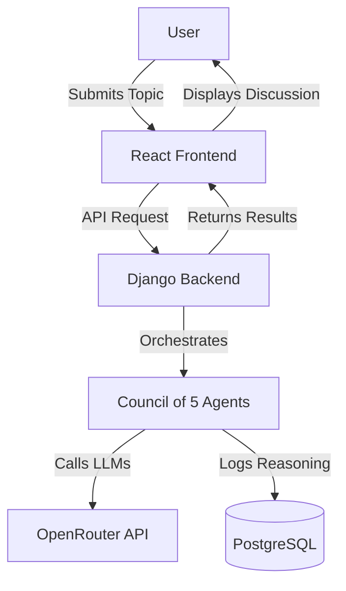
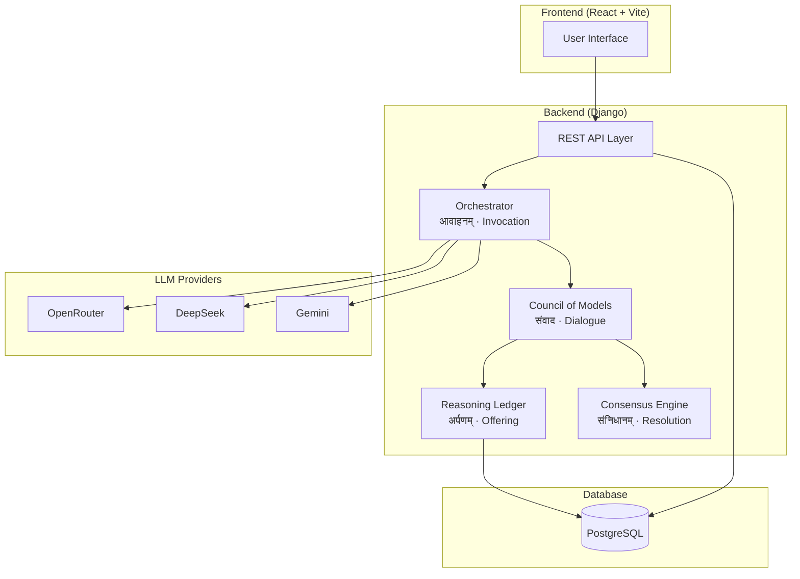
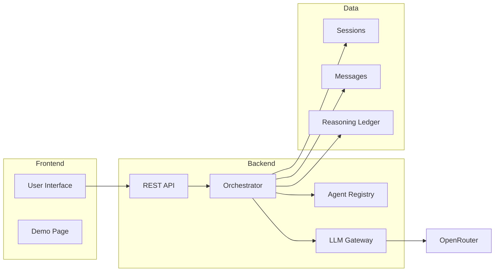
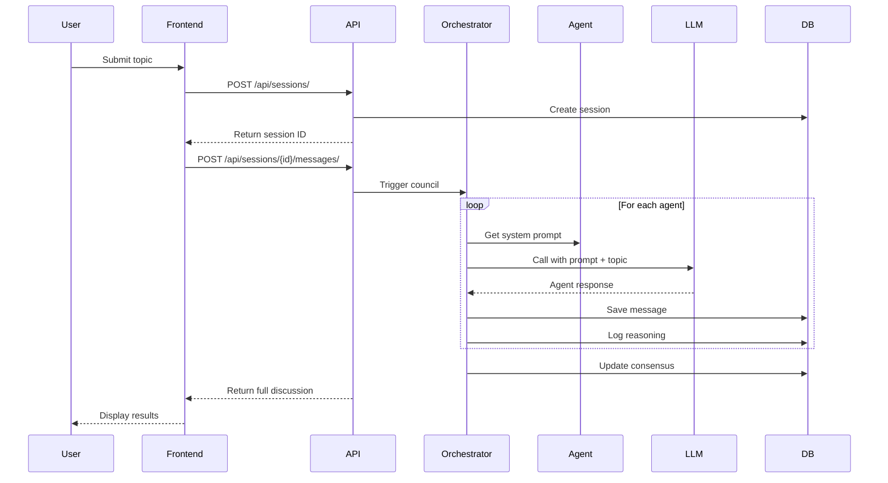

# Sabha - AI Parliament Architecture

> A multi-agent AI discussion system inspired by deliberative councils

---

## Overview

Sabha creates structured discussions between specialized AI agents, each playing a distinct role in analyzing a topic. The system orchestrates agent responses in a ritual-inspired flow called **यज्ञ (Yajna)**, producing a synthesized consensus from diverse viewpoints.

---

## System Architecture

### High-Level Overview

### Detailed Component Architecture

---

## The Council: Five Specialized Agents

| Agent          | Role             | Contribution                                              |
| -------------- | ---------------- | --------------------------------------------------------- |
| **Sutradhara** | Orchestrator     | Frames the discussion, sets agenda, defines key questions |
| **Pramana**    | Evidence Analyst | Provides factual data, research, historical precedents    |
| **Tarkika**    | Critic           | Challenges assumptions, identifies flaws and edge cases   |
| **Nirdeshaka** | Planner          | Proposes concrete action plans and implementation steps   |
| **Sahachara**  | Synthesizer      | Integrates perspectives, builds consensus                 |

Each agent has a distinct personality defined by its system prompt and speaks in sequence during deliberation.

---

## Workflow: The यज्ञ (Yajna) Flow

The deliberation follows four ritual-inspired stages:

### 1. आवाहनम् (Invocation)

**User submits a topic** → System creates a session and invokes the council

### 2. संवाद (Dialogue)

**Agents speak in sequence**, each contributing their perspective:

1. **Sutradhara** frames the topic
2. **Pramana** provides evidence
3. **Tarkika** raises counterpoints
4. **Nirdeshaka** proposes plans
5. **Sahachara** synthesizes consensus

### 3. अर्पणम् (Offering)

**Each agent's reasoning is logged** to the Reasoning Ledger, capturing:

- Rationale
- Objections raised
- Evidence cited
- Confidence level

### 4. संनिधानम् (Resolution)

**Sahachara produces final consensus** based on all agent inputs

---

## Component Architecture

### Core Components

**Frontend (React + Vite)**

- User interface for submitting topics
- Real-time display of agent responses
- Session history management

**Backend (Django)**

- **Orchestrator**: Coordinates agent flow, manages session state
- **Agent Registry**: Stores agent configurations and system prompts
- **LLM Gateway**: Unified interface to multiple LLM providers (OpenRouter, Gemini)
- **REST API**: Exposes sessions, messages, and agents endpoints

**Data Layer (PostgreSQL)**

- **Sessions**: Discussion instances with topics and status
- **Messages**: User inputs + agent responses with timestamps
- **Reasoning Ledger**: Structured logs of agent thinking
- **Agents**: Agent configurations (name, role, LLM model)

---

## Data Flow

### Creating a Discussion

---

## LLM Provider Strategy

All agents use **OpenRouter** as the primary gateway, which provides:

- Access to multiple models (GPT-4, Gemini, DeepSeek)
- Unified API interface
- Better rate limits than free-tier direct APIs

**Current Model Allocation:**

- **Sutradhara**: GPT-4o-mini (strong reasoning)
- **Pramana**: Gemini via OpenRouter (factual analysis)
- **Tarkika**: DeepSeek (critical thinking)
- **Nirdeshaka**: GPT-4o-mini (action-oriented)
- **Sahachara**: Gemini via OpenRouter (synthesis)

---

## Key Design Decisions

### Sequential vs Parallel Execution

**Current**: Agents respond **sequentially** in a fixed order

- Ensures each agent can reference previous responses
- Creates coherent narrative flow
- Simpler to implement and debug

**Future**: Could support parallel execution for faster responses

### Reasoning Ledger

Captures structured metadata about each agent's thinking:

- Enables debugging of agent behavior
- Supports replay and analysis
- Can be used for future training

### Session-Based Model

Each discussion is isolated in a session:

- Clean separation of topics
- Replayable history
- Easy to share or export

---

## API Structure

**Sessions**: Manage discussion instances

- Create new discussions
- Retrieve session history
- Trigger council deliberation

**Agents**: View agent configurations

- List available agents
- Get agent details (role, prompt, model)

**Messages**: Access discussion content

- View messages by session
- Includes user inputs and agent responses

---

## Frontend Integration

**Demo Page** (`Demo.jsx`) provides:

- Topic input form
- Real-time display of agent responses
- Session switching and history
- Consensus snapshot view

**Key UX Features**:

- Loading states during deliberation
- Agent avatars with role badges
- Collapsible reasoning details
- Consensus highlighting

---

## Scalability Considerations

**Current Scale**: Single-user development
**Future Scale**: Multi-tenant production

**Optimizations needed for production**:

- Async task queue (Celery) for council execution
- WebSocket support for real-time streaming
- Agent response caching for similar topics
- Rate limiting per user
- Authentication & authorization
- PostgreSQL connection pooling

---

## Security & Privacy

**Current State**: Development mode

- No authentication required
- SQLite database (local only)
- API keys in environment variables

**Production Requirements**:

- Token-based authentication (JWT)
- User session management
- API key encryption
- HTTPS enforcement
- CORS configuration
- Rate limiting

---

## Cost Estimation

**Per Council Discussion** (~5 agents × 800 tokens each):

- Total tokens: ~4,000 input + 4,000 output
- GPT-4o-mini: ~$0.005-0.01
- Gemini Flash: ~$0.002-0.005
- **Total per discussion**: $0.01-0.02

**Monthly costs** (100 discussions/day):

- ~$30-60/month at moderate usage
- Scales linearly with discussion volume

---

## Future Enhancements

**Phase 3 - Frontend Integration**:

- Wire Demo page to live API
- Add session management UI
- Display loading states

**Phase 4 - Production Ready**:

- Deploy backend to Render
- Deploy frontend to Vercel
- PostgreSQL migration
- Environment configuration

**Beyond MVP**:

- User authentication
- Session sharing and collaboration
- Custom agent creation
- Multi-language support
- Export discussions as PDFs
- Agent performance analytics
