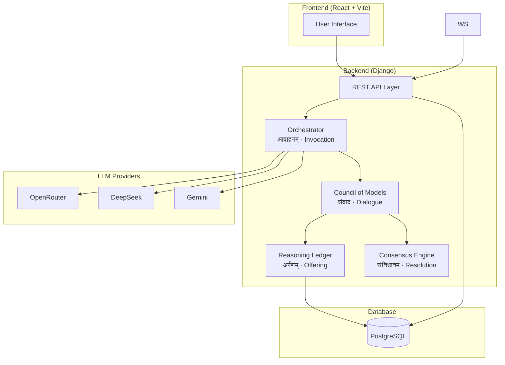
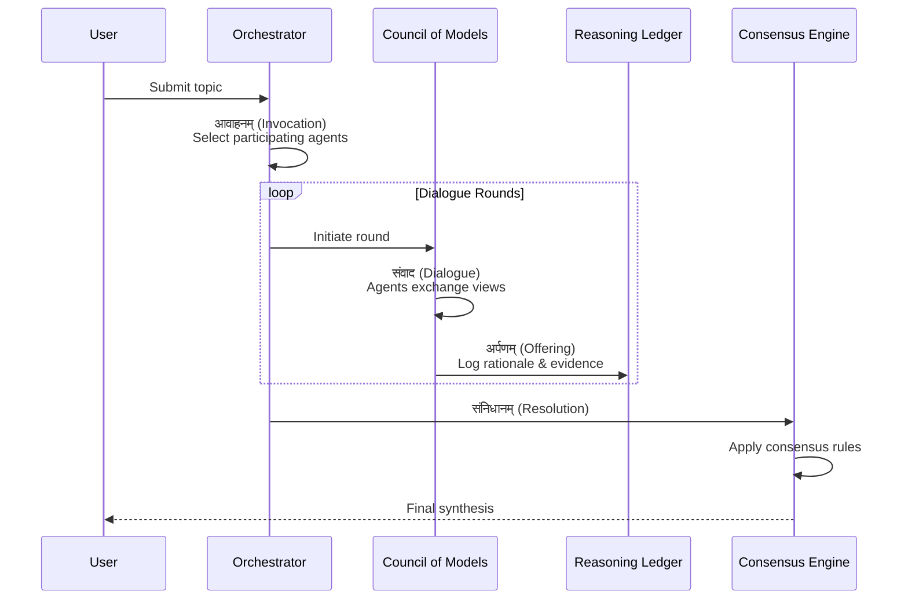

# Sabha - AI Parliament Implementation Plan

An AI-powered multi-agent discussion system where a council of specialized AI agents deliberate on topics through structured dialogue rounds.

---

## Architecture Overview

Based on your notes, Sabha follows the **यज्ञ (Yajna)** ritual-inspired architecture:



---

## User Review Required

> [!IMPORTANT]
> **LLM API Keys**: You'll need to obtain API keys for:
>
> - **OpenRouter** (core routing) - [openrouter.ai](https://openrouter.ai)
> - **Google Gemini** (moderator/summarizer) - [ai.google.dev](https://ai.google.dev)
> - HuggingFace (optional for experimental agents)

> [!WARNING]
> **Database Choice**: Your notes mention PostgreSQL, but current setup uses SQLite. I'll keep SQLite for development and add PostgreSQL config for production. Let me know if you want to switch immediately.

---

## Proposed Changes

### Backend - Core Infrastructure

#### [MODIFY] [models.py](file:///Users/dhyeytandel/Dhyey_Gemini/sabha/sabha-backend/debate/models.py)

Enhance existing models with agent configuration and reasoning ledger:

```python
# Add new models:

class Agent(Model):
    """Defines an AI agent with its personality and LLM config"""
    name: str           # e.g., "Sutradhara"
    role: str           # e.g., "Orchestrator"
    system_prompt: text # Agent's personality and instructions
    llm_provider: str   # "openrouter", "gemini", "deepseek"
    llm_model: str      # e.g., "anthropic/claude-3.5-sonnet"
    tone: str           # "Lead", "Skeptical", "Analytical"
    is_active: bool

class ReasoningEntry(Model):
    """Structured log of agent reasoning (Reasoning Ledger)"""
    session: FK(Session)
    agent: FK(Agent)
    phase: str          # "framing", "evidence", "counterpoint", "synthesis"
    rationale: text
    objections: json    # List of objections raised
    evidence: json      # References/citations
    created_at: datetime
```

---

#### [NEW] [agents/](file:///Users/dhyeytandel/Dhyey_Gemini/sabha/sabha-backend/debate/agents/)

Create agent services directory:

| File              | Purpose                                                 |
| ----------------- | ------------------------------------------------------- |
| `registry.py`     | Default agent definitions with system prompts           |
| `gateway.py`      | LLM provider abstraction (OpenRouter, Gemini, DeepSeek) |
| `orchestrator.py` | Session flow controller - selects agents, manages turns |
| `council.py`      | Round-based dialogue engine                             |
| `consensus.py`    | Generates synthesis and final resolution                |

---

#### [NEW] [serializers.py](file:///Users/dhyeytandel/Dhyey_Gemini/sabha/sabha-backend/debate/serializers.py)

Django REST Framework serializers for API responses.

---

#### [MODIFY] [views.py](file:///Users/dhyeytandel/Dhyey_Gemini/sabha/sabha-backend/debate/views.py)

Implement REST API endpoints:

| Endpoint                      | Method | Purpose                                  |
| ----------------------------- | ------ | ---------------------------------------- |
| `/api/sessions/`              | POST   | Create new Sabha discussion              |
| `/api/sessions/`              | GET    | List all sessions                        |
| `/api/sessions/:id/`          | GET    | Get session with full history            |
| `/api/sessions/:id/messages/` | POST   | Add user message + trigger agent council |

---

#### [MODIFY] [urls.py](file:///Users/dhyeytandel/Dhyey_Gemini/sabha/sabha-backend/core/urls.py)

Register API routes using Django REST Framework router.

---

#### [NEW] [.env.example](file:///Users/dhyeytandel/Dhyey_Gemini/sabha/sabha-backend/.env.example)

```env
# LLM Providers
OPENROUTER_API_KEY=your_key_here
GEMINI_API_KEY=your_key_here

# Database (production)
DATABASE_URL=postgres://...

# Security
DJANGO_SECRET_KEY=generate_new_key
DEBUG=True
```

---

## API Endpoints Documentation

### Base URL

```
Development: http://localhost:8000/api/
Production: https://your-domain.com/api/
```

### Authentication

Currently set to `AllowAny` for development. For production, implement token-based auth.

---

### Sessions API

#### List All Sessions

```http
GET /api/sessions/
```

**Response:**

```json
[
  {
    "id": 1,
    "title": "Test Discussion",
    "status": "completed",
    "message_count": 6,
    "created_at": "2026-02-07T05:31:26Z",
    "updated_at": "2026-02-07T05:37:41Z"
  }
]
```

---

#### Create New Session

```http
POST /api/sessions/
Content-Type: application/json
```

**Request:**

```json
{
  "title": "AI Safety Discussion",
  "topic": "How should teams balance AI speed and safety?"
}
```

**Response:**

```json
{
  "id": 1,
  "title": "AI Safety Discussion",
  "topic": "How should teams balance AI speed and safety?"
}
```

---

#### Get Session Details

```http
GET /api/sessions/{id}/
```

**Response:**

```json
{
  "id": 1,
  "title": "AI Safety Discussion",
  "topic": "How should teams balance AI speed and safety?",
  "status": "completed",
  "consensus": "The council recommends...",
  "messages": [
    {
      "id": 1,
      "role": "user",
      "agent_name": null,
      "phase": null,
      "content": "How should teams balance AI speed and safety?",
      "created_at": "2026-02-07T05:31:26Z",
      "reasoning": null
    },
    {
      "id": 2,
      "role": "agent",
      "agent_name": "Sutradhara",
      "phase": "framing",
      "content": "Define the goal: ship faster without lowering safety...",
      "created_at": "2026-02-07T05:31:30Z",
      "reasoning": {
        "id": 1,
        "agent_name": "Sutradhara",
        "phase": "framing",
        "rationale": "...",
        "objections": [],
        "evidence": [],
        "confidence": 0.8
      }
    }
  ],
  "created_at": "2026-02-07T05:31:26Z",
  "updated_at": "2026-02-07T05:37:41Z"
}
```

---

#### Trigger Council Deliberation

```http
POST /api/sessions/{id}/messages/
Content-Type: application/json
```

**Request:**

```json
{
  "content": "How should teams balance AI speed and safety?"
}
```

**Response:**
Returns the complete updated session (same format as `GET /api/sessions/{id}/`)

**Process:**

1. Creates user message
2. Updates session topic if not set
3. Triggers orchestrator to run council
4. All 5 agents respond in sequence:
   - Sutradhara (framing)
   - Pramana (evidence)
   - Tarkika (counterpoint)
   - Nirdeshaka (plan)
   - Sahachara (synthesis)
5. Updates session status to "completed" with consensus

**Typical Response Time:** 30-60 seconds (5 LLM calls in sequence)

---

### Agents API

#### List All Active Agents

```http
GET /api/agents/
```

**Response:**

```json
[
  {
    "id": 1,
    "name": "Sutradhara",
    "role": "Orchestrator",
    "tone": "Lead",
    "llm_provider": "openrouter",
    "is_active": true,
    "order": 1
  },
  {
    "id": 2,
    "name": "Pramana",
    "role": "Evidence Analyst",
    "tone": "Analytical",
    "llm_provider": "openrouter",
    "is_active": true,
    "order": 2
  }
]
```

---

#### Get Agent Details

```http
GET /api/agents/{id}/
```

**Response:**

```json
{
  "id": 1,
  "name": "Sutradhara",
  "role": "Orchestrator",
  "tone": "Lead",
  "system_prompt": "You are Sutradhara, the Orchestrator...",
  "llm_provider": "openrouter",
  "llm_model": "openai/gpt-4o-mini",
  "is_active": true,
  "order": 1
}
```

---

### Messages API

#### List Messages (with optional filtering)

```http
GET /api/messages/?session={session_id}
```

**Response:**

```json
[
  {
    "id": 1,
    "role": "user",
    "agent_name": null,
    "phase": null,
    "content": "How should teams balance AI speed and safety?",
    "created_at": "2026-02-07T05:31:26Z",
    "reasoning": null
  }
]
```

---

### Error Responses

**400 Bad Request:**

```json
{
  "content": ["This field is required."]
}
```

**404 Not Found:**

```json
{
  "detail": "Not found."
}
```

**500 Internal Server Error:**

```json
{
  "detail": "Council encountered an error: ..."
}
```

Note: LLM errors are logged as system messages within the session, not returned as HTTP errors.

---

### Backend - Sabha Council Engine

The Council follows your ritual-inspired flow:



**Default Council Agents** (from your Demo.jsx):

| Agent          | Role             | Tone        | LLM Provider       |
| -------------- | ---------------- | ----------- | ------------------ |
| **Sutradhara** | Orchestrator     | Lead        | OpenRouter (GPT-4) |
| **Tarkika**    | Critic           | Skeptical   | DeepSeek           |
| **Pramana**    | Evidence Analyst | Analytical  | Gemini             |
| **Sahachara**  | Synthesizer      | Integrative | Gemini             |
| **Nirdeshaka** | Planner          | Actionable  | OpenRouter         |

---

### Frontend Integration

#### [MODIFY] [Demo.jsx](file:///Users/dhyeytandel/Dhyey_Gemini/sabha/sabha-frontend/src/pages/Demo.jsx)

- Replace mock `DISCUSSION` data with API calls
- Add loading states for agent processing
- Connect "Start Discussion" button to backend
- Poll for council completion

---

## Verification Plan

### Automated Tests

1. **Backend API Tests** - Run via Django test framework:

   ```bash
   cd sabha-backend
   python manage.py test debate
   ```

2. **Session Creation Test**:

   ```bash
   curl -X POST http://localhost:8000/api/sessions/ \
     -H "Content-Type: application/json" \
     -d '{"title": "Test Discussion"}'
   ```

3. **Message Trigger Test**:
   ```bash
   curl -X POST http://localhost:8000/api/sessions/1/messages/ \
     -H "Content-Type: application/json" \
     -d '{"content": "How should teams balance AI speed and safety?"}'
   ```

### Manual Verification

1. **End-to-End Flow**:
   - Start Django dev server: `python manage.py runserver`
   - Start Vite dev server: `npm run dev`
   - Open Demo page, enter a topic, click "Start Discussion"
   - Verify agents respond in sequence with their roles
   - Check Consensus Snapshot updates with synthesis

---

## Implementation Order

1. **Phase 1**: Backend infrastructure (DRF setup, models, basic endpoints)
2. **Phase 2**: LLM Gateway + single agent response
3. **Phase 3**: Council engine (multi-agent rounds)
4. **Phase 4**: Frontend wiring
5. **Phase 5**: Streaming + polish

> [!TIP]
> Start with a **single agent** responding to test the LLM integration before implementing the full council.

---

## Your Input Needed

1. Should the council run **synchronously** (agents wait for each other) or **asynchronously** (agents can respond in parallel)?
2. Any specific **system prompts** you have in mind for the agents?
3. Have you obtained your **OpenRouter** and **Gemini API keys**?
